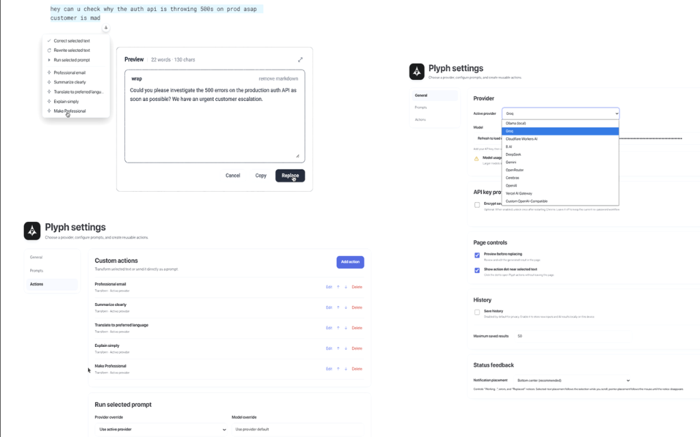

# Plyph for Chrome

Use AI on selected text in Chrome. Correct writing, rewrite text, run a selection as a prompt, or create custom actions. Results can be reviewed and edited before replacing the original selection.

## Install

**Chrome Web Store:** Pending review

### Manual installation

1. Download or clone this repository.
2. Open `chrome://extensions`.
3. Enable **Developer mode**.
4. Click **Load unpacked**.
5. Select the Plyph extension directory.
6. Open Plyph settings, choose a provider, and add your API key or Ollama URL.

## Features

- **Multiple AI providers** — Ollama, Groq, Cloudflare Workers AI, B.AI, DeepSeek, Gemini, OpenRouter, Cerebras, OpenAI, Vercel AI Gateway, and Custom OpenAI-Compatible
- **Model discovery** — Refresh available models after configuring a provider, while still allowing manual model names
- **Built-in actions** — Professional email, summarize, translate, and explain simply
- **Custom actions** — Create your own prompts with variables, provider, model, and token limits
- **Flexible UI** — Floating action menu, context menu, toolbar popup, and keyboard shortcuts
- **Review before replace** — Preview and edit AI output before applying it
- **History** — Optional local history of inputs and results, disabled by default for privacy
- **Configurable feedback** — Place status messages at the bottom, beside the selection, or near the mouse
- **Local-first privacy** — API keys stay in Chrome extension storage, with optional password-based encryption, and local Ollama can run entirely on your machine

## Usage

Select text on a normal web page, then use the toolbar button, context menu, floating action menu, or keyboard shortcut.

Plyph can show a small action dot beside selected text. Click it to open the action menu, or right-click selected text and open the **Plyph** submenu.

The floating action dot can be disabled under **Settings → General → Page controls**.

New installations include example actions for professional email, summarizing, translating, and simple explanations. They can be edited or deleted like any other custom action.

History is disabled by default. Enable **Save history** in Settings or on the History page when you want to review, copy, delete, or clear locally stored results.

Status feedback such as **Working…**, errors, and **Replaced** defaults to the bottom center and can instead appear beside the selected text or near the mouse pointer.

## Supported Fields

- Text inputs (`<input>`, `<textarea>`)
- Contenteditable elements
- Most rich-text editors

Some complex editors manage their own document model and may not accept automatic text replacement.

The extension cannot run on Chrome internal pages such as `chrome://extensions` or on the Chrome Web Store.

## Privacy

- Text is sent only when you explicitly run an action
- API keys are stored locally using Chrome's `storage.local`
- Optional API-key encryption uses a password-protected local vault and keeps unlocked keys in memory-only `storage.session` until Chrome restarts
- Ollama does not require an API key
- Local Ollama works with the standard localhost configuration without requiring changes to Ollama's CORS settings
- History is disabled by default
- No telemetry or background network requests
